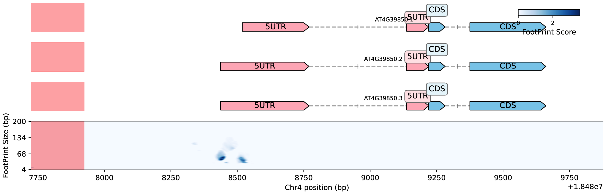
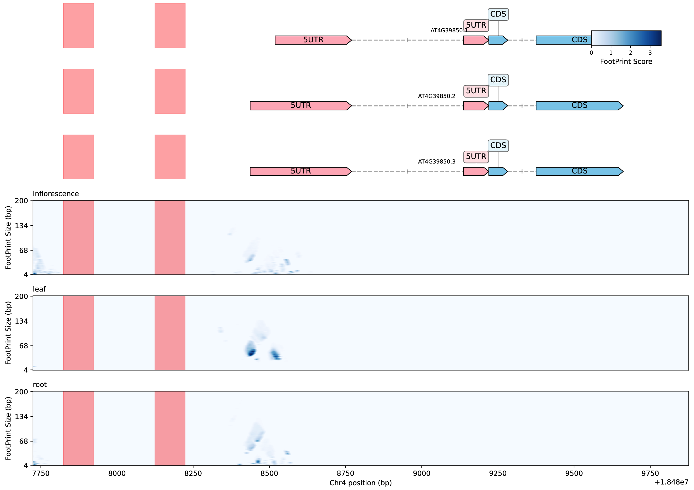

# DNA Features Viewer - 增强版


## 项目简介

**DNA Features Viewer** 是一个强大的Python包，专门用于可视化DNA序列特征。本项目基于[Edinburgh Genome Foundry的DNA Features Viewer](https://github.com/Edinburgh-Genome-Foundry/DnaFeaturesViewer)进行了增强改造，**重点新增了FootprintViewer模块**，专门用于FootPrint数据的可视化分析。

### 为什么进行改造？

原始的DNA Features Viewer主要专注于基因注释的可视化，而在表观遗传学研究中，FootPrint分析（如DNase-seq、ATAC-seq等开放染色质数据）是理解基因调控机制的重要手段。为了满足这一需求，我们开发了专门的**FootprintViewer模块**，提供：

- 🔬 **专业的FootPrint数据可视化**
- 📊 **多组织比较分析**
- 🎯 **智能基因注释布局**
- 🎨 **高质量科研图表输出**

## 核心功能：FootprintViewer模块

`FootprintViewer`是本项目核心新增模块，专门为FootPrint数据分析而设计：

### ✨ 主要特性

| 功能特性 | 描述 |
|---------|------|
| **基因注释可视化** | 自动从基因组FASTA和GFF3文件生成专业基因结构图 |
| **FootPrint热图** | 高分辨率可视化不同大小FootPrint的分数分布 |
| **智能布局系统** | 自动处理重叠转录本，避免视觉冲突 |
| **内含子连接** | 同一转录本的外显子间用虚线连接，清晰表示基因结构 |
| **多组织比较** | 同时展示多个组织的FootPrint数据差异 |
| **区域高亮** | 标记感兴趣的特定基因组区域 |
| **矢量输出** | 支持PDF、SVG等高质量矢量格式，适合科研发表 |

### 🎯 核心函数

#### 1. 单组织分析：`plot_region_with_footprints`
```python
from dna_features_viewer.FootprintViewer import plot_region_with_footprints

fig = plot_region_with_footprints(
    genome_fasta=None,
    gff3_file='./examples/FootprintViewer/data/annotations.gff3',
    fp_score_file='./examples/FootprintViewer/data/leaf_footprints.parquet',
    chrom='Chr4',
    start=18487724,
    end=18489875,
    highlight_regions=[(18487824, 18487924)],  # 高亮感兴趣区域
    output_file='single_tissue_analysis.pdf'
)
```

#### 2. 多组织比较：`plot_multi_tissue_comparison`
```python
from dna_features_viewer.FootprintViewer import plot_multi_tissue_comparison

fp_files = {
    'leaf': './examples/FootprintViewer/data/arabidopsis_leaf_test.parquet', 
    'root': './examples/FootprintViewer/data/arabidopsis_root_test.parquet',
    'inflorescence': './examples/FootprintViewer/data/arabidopsis_inflorescence_test.parquet'
}

fig = plot_multi_tissue_comparison(
    genome_fasta=None,
    gff3_file='./examples/FootprintViewer/data/arabidopsis_test.gff3',
    fp_files_dict=fp_files,
    chrom='Chr4',
    start=18487724,
    end=18489875,
    highlight_regions=[(18487824, 18487924)],
    output_file='multi_tissue_comparison.pdf'
)
```

### 🏗️ 模块架构

```
FootprintViewer/
├── __init__.py           # 模块入口和API导出
├── api.py               # 高级API接口函数
├── genbank_creator.py   # GenBank文件动态创建
├── data_processor.py    # FootPrint数据处理和转换
├── visualizer.py        # 核心可视化引擎
└── README.md           # 详细技术文档
```

## 🚀 安装指南

### 推荐安装方式：使用uv

[uv](https://github.com/astral-sh/uv)是一个超快的Python包管理器，推荐使用它来管理项目环境：

#### 1. 安装uv
```bash
# Linux/macOS
curl -LsSf https://astral.sh/uv/install.sh | sh

# Windows
powershell -c "irm https://astral.sh/uv/install.ps1 | iex"

# 或使用pip安装
pip install uv
```

#### 2. 创建项目环境
```bash
# 克隆项目
git clone https://github.com/yuechaowu/DnaFeaturesViewer.git
cd DnaFeaturesViewer

# 创建虚拟环境
uv venv .venv

# 激活环境（Linux/macOS）
source .venv/bin/activate
# Windows: .venv\Scripts\activate

# 同步依赖（根据pyproject.toml自动安装所有依赖）
uv sync

# 以开发模式安装当前包
uv pip install -e .

# 安装Jupyter内核（用于运行示例notebook）
python -m ipykernel install --user --name=dna_features_viewer_FootPrintView --display-name "dna_features_viewer_FootPrintView"
```

#### 3. 验证安装
```python
# 启动Python并测试导入
python -c "from dna_features_viewer.FootprintViewer import plot_region_with_footprints; print('安装成功！')"
```

### 传统安装方式
```bash
pip install -e .
```

## 📊 测试数据

项目提供了完整的测试数据集，位于`examples/FootprintViewer/data/`目录：

| 文件名 | 描述 | 用途 |
|--------|------|------|
| `arabidopsis_test.gff3` | 拟南芥基因组注释文件 | 提供基因结构信息 |
| `arabidopsis_inflorescence_test.parquet` | 拟南芥inflorescence组织FootPrint数据 | 花序组织的开放染色质信息 |
| `arabidopsis_leaf_test.parquet` | 拟南芥leaf组织FootPrint数据 | 叶片组织的开放染色质信息 |
| `arabidopsis_root_test.parquet` | 拟南芥root组织FootPrint数据 | 根部组织的开放染色质信息 |

### 数据格式说明

**FootPrint分数文件**（Parquet格式）包含以下列：
- `chrom`: 染色体名称（如"Chr1"）
- `pos`: 基因组位置（1-based坐标）
- `radius`: FootPrint大小/半径（bp）
- `score`: FootPrint分数值

## 📖 使用示例

### 完整示例Notebook

```bash
# 示例代码路径
./examples/FootprintViewer/
```

运行完整的分析示例：
```bash
# 启动Jupyter Notebook
jupyter notebook examples/FootprintViewer/FootprintViewer_example.ipynb
```

### 📁 输出结果
运行示例代码后，会在`examples/FootprintViewer/output/`目录下生成以下可视化结果：

```
output/
├── single_tissue_footprint.pdf    # 单组织FootPrint分析结果
└── multi_tissue_footprint.pdf     # 多组织比较分析结果
```

这些高质量的PDF文件展示了FootprintViewer模块的强大可视化能力，详细结果展示请参见下方的[📊 可视化结果展示](#-可视化结果展示)章节。


## 📊 可视化结果展示

以下是使用FootprintViewer模块生成的实际可视化结果，展示了该工具在FootPrint数据分析中的强大能力：

### 🔬 单组织FootPrint分析结果

**文件位置**：`examples/FootprintViewer/output/single_tissue_footprint.pdf`



该图展示了：
- **基因结构注释**：清晰显示目标区域的基因结构，包括外显子、内含子和转录方向
- **FootPrint热图**：不同大小FootPrint的分数分布，颜色深度表示信号强度
- **区域高亮**：突出显示感兴趣的特定基因组区域
- **坐标系统**：精确的基因组位置标注，便于定位分析

### 🎯 多组织比较分析结果

**文件位置**：`examples/FootprintViewer/output/multi_tissue_footprint.pdf`



该图展示了：
- **多组织并排比较**：同时展示leaf（叶片）、root（根部）、inflorescence（花序）三个组织的FootPrint数据
- **组织特异性差异**：直观比较不同组织间开放染色质区域的差异

### 🎨 可视化特点

| 特征 | 描述 | 科研价值 |
|------|------|----------|
| **高分辨率输出** | 矢量PDF格式，支持无损缩放 | 适合科研论文发表 |
| **专业配色方案** | 科研级颜色搭配，清晰易读 | 提升图表专业度 |
| **智能布局** | 自动处理重叠基因，避免视觉冲突 | 保证信息完整性 |
| **多尺度展示** | 同时显示基因结构和FootPrint信号 | 多层次数据整合 |
| **交互性强** | 支持区域高亮和自定义标注 | 灵活的分析需求 |

### 📈 应用场景

这些可视化结果特别适用于：
- **表观遗传学研究**：分析不同组织的开放染色质模式
- **基因调控分析**：识别组织特异性调控元件
- **比较基因组学**：跨组织/条件的FootPrint差异分析
- **科研论文配图**：高质量的学术发表图表

## 🛠️ 其他功能模块

除了核心的FootprintViewer模块，本包还保留了原始DNA Features Viewer的所有功能。详细使用方法请参考：

- 📚 **完整文档**：`README.rst`
- 🌐 **在线文档**：[原项目文档](https://edinburgh-genome-foundry.github.io/DnaFeaturesViewer/)
- 📋 **更多示例**：`examples/`目录中的其他示例

支持的功能包括：
- GenBank/GFF文件可视化
- 序列特征标注
- 圆形基因组图谱
- 交互式Bokeh图表
- 自定义样式和主题

## 📋 TODO清单

### 🎯 近期计划

- [ ] **4.1 扩展数据格式支持**
  - [ ] 支持BigWig（.bw）文件格式
  - [ ] 支持BED文件格式
  - [ ] 添加格式转换工具

- [ ] **4.2 现代化开发环境支持**
  - [ ] 支持[marimo](https://marimo.io/)交互式notebook
  - [ ] 优化Jupyter Lab集成
  - [ ] 添加VS Code扩展支持

### 🔮 未来规划

- [ ] 添加更多可视化样式选项
- [ ] 支持大规模基因组数据的内存优化
- [ ] 集成统计分析功能
- [ ] 开发Web界面版本

## 🤝 贡献与支持

### 原项目致谢

本项目基于Edinburgh Genome Foundry开发的优秀开源项目：
- **原作者**：[Edinburgh Genome Foundry](https://github.com/Edinburgh-Genome-Foundry/DnaFeaturesViewer)
- **原项目地址**：https://github.com/Edinburgh-Genome-Foundry/DnaFeaturesViewer
- **许可证**：MIT License

### 项目维护

- **当前维护者**：WuYueChao
- **项目地址**：https://github.com/yuechaowu/DnaFeaturesViewer.git

### 如何贡献

我们欢迎各种形式的贡献：
- 🐛 Bug报告和修复
- 💡 新功能建议
- 📝 文档改进
- 🧪 测试用例添加

## 📄 许可证

本项目采用MIT许可证，详见[LICENSE](LICENSE)文件。

---

<div align="center">

**🧬 让DNA数据可视化变得简单而美丽 🎨**

[原项目](https://github.com/Edinburgh-Genome-Foundry/DnaFeaturesViewer) | [文档](https://edinburgh-genome-foundry.github.io/DnaFeaturesViewer/) | [问题反馈](https://github.com/yuechaowu/DnaFeaturesViewer/issues)

</div>
